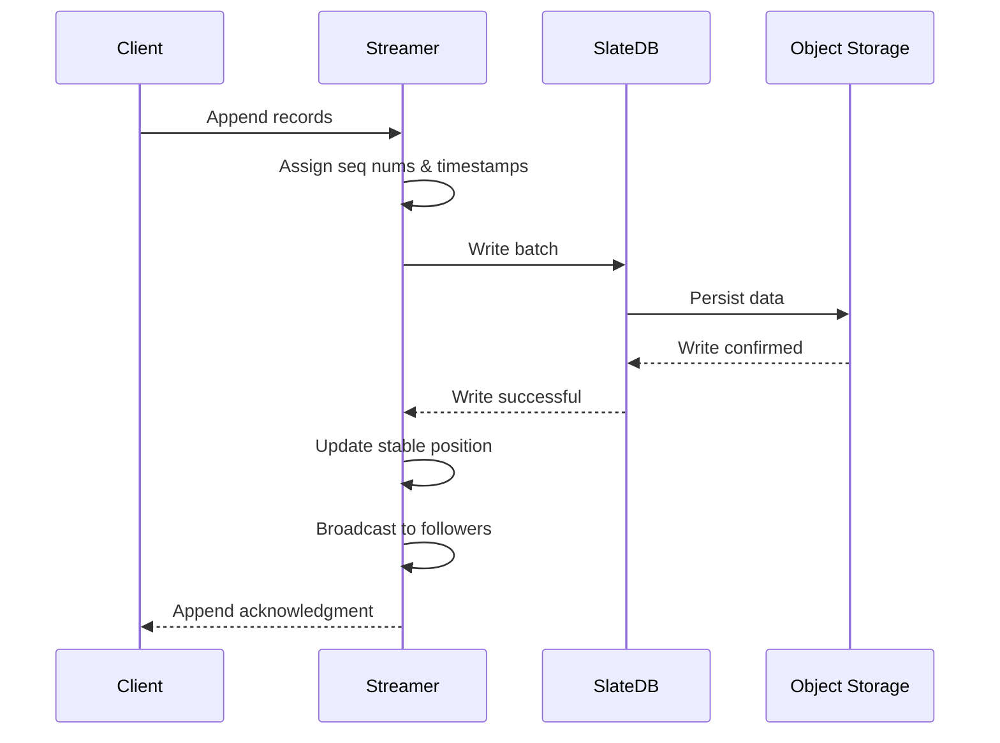

Durability is a core principle of S2's design. All acknowledged writes are guaranteed to be durable on object storage before clients receive confirmation.

## Durability guarantee

S2 provides a strong durability guarantee:

<Note>
**All acknowledged appends are durable on object storage before the acknowledgment is returned to the client.**
</Note>

This means:

- **No acknowledged data loss**: If you receive an ack, the data is durable
- **No silent failures**: Failed writes return errors, not acknowledgments
- **Crash recovery**: Server crashes cannot lose acknowledged data
- **Consistent reads**: Acknowledged writes are immediately visible to all readers

## Write path durability

The append operation follows a strict durability protocol:



### Write implementation

From `/home/daytona/workspace/source/lite/src/backend/streamer.rs:626-679`:

```rust
async fn db_write_records(
    db: slatedb::Db,
    stream_id: StreamId,
    retention: RetentionPolicy,
    records: Vec<Metered<SequencedRecord>>,
    // ...
) -> Result<Vec<Metered<SequencedRecord>>, slatedb::Error> {
    // Build write batch with all records
    let mut wb = WriteBatch::new();
    for (position, record) in records.iter().map(|msr| msr.parts()) {
        wb.put_with_options(
            kv::stream_record_data::ser_key(stream_id, position),
            kv::stream_record_data::ser_value(record),
            &ttl_put_opts,
        );
        // Also write timestamp index
        wb.put_with_options(
            kv::stream_record_timestamp::ser_key(stream_id, position),
            kv::stream_record_timestamp::ser_value(),
            &ttl_put_opts,
        );
    }
    // Update tail position
    wb.put(
        kv::stream_tail_position::ser_key(stream_id),
        kv::stream_tail_position::ser_value(next_pos(&records), write_timestamp_secs),
    );
    
    // Write with await_durable flag
    static WRITE_OPTS: WriteOptions = WriteOptions {
        await_durable: true,
    };
    db.write_with_options(wb, &WRITE_OPTS).await?;
    Ok(records)
}
```

Key aspects:

1. **Atomic batch writes**: All records in a batch are written together
2. **await_durable flag**: Write only returns after durability is confirmed
3. **Tail position update**: Included in the same atomic write

### SlateDB durability

s2-lite uses **SlateDB** as its storage engine, which provides:

- **LSM-tree structure**: Write-optimized log-structured merge tree
- **Object storage backend**: All data stored in S3-compatible object storage
- **Write-ahead log**: Changes are logged before being applied
- **Flush intervals**: Configurable intervals for flushing to object storage

From the README (`/home/daytona/workspace/source/README.md:59-61`):

> It uses SlateDB as its storage engine, which relies entirely on object storage for durability.
> Just like s2.dev, data is always durable on object storage before being acknowledged or returned to readers.

### Configuring flush intervals

SlateDB's flush interval controls how often in-memory data is flushed to object storage:

```bash
# Default: 50ms for remote bucket, 5ms for in-memory
SL8_FLUSH_INTERVAL=10ms s2 lite --bucket my-bucket
```

<Warning>
Lower flush intervals reduce append latency but increase object storage API calls. Higher intervals improve throughput but increase memory usage.
</Warning>

## Storage layout

Records are stored in SlateDB with two keys per record:

From `/home/daytona/workspace/source/lite/src/backend/kv/mod.rs:87-98`:

### Record data

```rust
/// (SRD) per-record, immutable
/// Key: StreamID StreamPosition
/// Value: EnvelopeRecord
StreamRecordData(StreamId, StreamPosition),
```

- **Key**: Stream ID + sequence number + timestamp
- **Value**: The encoded record (headers + body)
- **Immutable**: Never updated after write
- **TTL**: Respects retention policy

### Record timestamp index

```rust
/// (SRT) per-record, immutable
/// Key: StreamID Timestamp SeqNum
/// Value: empty
StreamRecordTimestamp(StreamId, StreamPosition),
```

- **Key**: Stream ID + timestamp + sequence number
- **Value**: Empty (existence is sufficient)
- **Purpose**: Enables timestamp-based reads
- **TTL**: Same as record data

### Tail position

```rust
/// (SP) per-stream, updatable
/// Key: StreamID
/// Value: SeqNum Timestamp WriteTimestampSecs
StreamTailPosition(StreamId),
```

- Atomically updated with each append
- Includes write timestamp for freshness tracking
- Used to determine the next sequence number

## Retention and TTL

Records can be automatically trimmed based on age:

From `/home/daytona/workspace/source/lite/src/backend/streamer.rs:635-638`:

```rust
let ttl = match retention {
    RetentionPolicy::Age(age) => Ttl::ExpireAfter(age.as_millis() as u64),
    RetentionPolicy::Infinite() => Ttl::NoExpiry,
};
```

- **Age-based**: Records expire after the configured duration
- **Infinite**: Records never expire automatically
- **TTL enforcement**: SlateDB handles expiration during compaction

<Info>
Expired records are removed during SlateDB compaction, not immediately upon expiration.
</Info>

## Pipelining and performance

To achieve high throughput, s2-lite supports **pipelined appends**:

From `/home/daytona/workspace/source/lite/src/backend/streamer.rs:111-116`:

```rust
append_futs: FuturesOrdered<BoxFuture<'static, Result<Vec<...>, slatedb::Error>>>,
pending_appends: append::PendingAppends::new(),
stable_pos: tail_pos,
```

- **Multiple in-flight appends**: Appends pipeline to object storage
- **Ordered completion**: Results are processed in order via `FuturesOrdered`
- **Backpressure**: Semaphore limits total in-flight bytes

From the README (`/home/daytona/workspace/source/README.md:177-179`):

> Pipelining is temporarily disabled by default, and it will be enabled once it is completely safe.
> For now, you can use `S2LITE_PIPELINE=true` to get a sense of what performance will look like.

### Backpressure mechanism

From `/home/daytona/workspace/source/lite/src/backend/streamer.rs:93-96`:

```rust
let append_inflight_bytes_max =
    (append_inflight_max.as_u64() as usize).min(Semaphore::MAX_PERMITS);

let append_inflight_bytes_sema = Arc::new(Semaphore::new(append_inflight_bytes_max));
```

Appends acquire permits based on metered size:

From `/home/daytona/workspace/source/lite/src/backend/streamer.rs:464-476`:

```rust
let metered_size = input.records.metered_size();
let num_permits = metered_size.clamp(1, self.append_inflight_bytes_max) as u32;
let sema_permit = tokio::select! {
    res = self.append_inflight_bytes_sema.acquire_many(num_permits) => {
        res.map_err(|_| StreamerMissingInActionError)
    }
    _ = self.msg_tx.closed() => {
        Err(StreamerMissingInActionError)
    }
}?;
```

## Failure scenarios

### Client fails before receiving ack

**Scenario**: Client sends append, server writes to storage, but client disconnects before receiving ack.

**Result**: 
- Records are durable and assigned sequence numbers
- Client doesn't know if append succeeded
- Client can use `match_seq_num` on retry to detect duplicate

### Server crashes after write

**Scenario**: Server writes to object storage and crashes before sending ack.

**Result**:
- Records are durable on object storage
- On restart, server loads tail position from storage
- All durable records are visible to readers

### Object storage write fails

**Scenario**: SlateDB write to object storage returns an error.

**Result**:
- Error propagated to streamer
- All pending appends for that write fail
- Client receives error, knows append did not succeed
- Client can safely retry

From `/home/daytona/workspace/source/lite/src/backend/streamer.rs:377-381`:

```rust
Err(db_err) => {
    self.pending_appends.on_durability_failed(db_err);
    break;
}
```

### Network partition

**Scenario**: Network partition between s2-lite and object storage.

**Result**:
- Writes fail and return errors
- No acknowledgments sent to clients
- No data loss occurs
- Service resumes when partition heals

## Comparing with other systems

| System | Durability Model | Acknowledgment |
|--------|-----------------|----------------|
| **S2** | Durable before ack | After object storage write |
| Kafka | Configurable | After replication (if acks=all) |
| Redis Streams | In-memory | Immediately (unless AOF sync) |
| Kinesis | Durable before ack | After multi-AZ replication |
| Pulsar | Configurable | After quorum write to bookies |

<Info>
S2's object storage backend provides 11 nines of durability (99.999999999%) with services like AWS S3.
</Info>

## Monitoring durability

Key metrics to monitor:

### Write latency

```bash
curl http://localhost:8080/metrics | grep append_ack_latency
```

From `/home/daytona/workspace/source/lite/src/backend/streamer.rs:574`:

- Measures time from append request to ack
- Includes durability confirmation
- Should correlate with object storage latency

### Flush metrics

SlateDB exposes flush-related metrics:

- **flush_interval**: Configured flush interval
- **flush_duration**: Actual time to complete flush
- **flush_bytes**: Bytes flushed per interval

### Health checks

```bash
curl http://localhost:8080/health
```

Returns 200 OK when:
- Server is running
- Can accept requests
- SlateDB is operational

## Best practices

1. **Trust the ack**: Only consider writes successful when ack is received
2. **Handle errors**: Implement retry logic for failed appends
3. **Use match_seq_num**: Prevent duplicates on retry with optimistic concurrency
4. **Monitor latency**: Watch write latency to detect object storage issues
5. **Configure flush interval**: Tune based on latency/throughput requirements
6. **Test failure scenarios**: Verify application handles partial failures correctly

## Object storage options

S2-lite works with any S3-compatible object storage:

### AWS S3

```bash
docker run -p 8080:80 \
  -e AWS_PROFILE=${AWS_PROFILE} \
  -v ~/.aws:/home/nonroot/.aws:ro \
  ghcr.io/s2-streamstore/s2 lite \
  --bucket ${S3_BUCKET} \
  --path s2lite
```

### Tigris, Cloudflare R2, etc.

```bash
docker run -p 8080:80 \
  -e AWS_ACCESS_KEY_ID=${AWS_ACCESS_KEY_ID} \
  -e AWS_SECRET_ACCESS_KEY=${AWS_SECRET_ACCESS_KEY} \
  -e AWS_ENDPOINT_URL_S3=${AWS_ENDPOINT_URL_S3} \
  ghcr.io/s2-streamstore/s2 lite \
  --bucket ${S3_BUCKET} \
  --path s2lite
```

### Local disk

```bash
s2 lite --local-root ./data
```

<Warning>
Local disk provides durability only as good as the local filesystem. Use object storage for production workloads.
</Warning>

### In-memory (testing)

```bash
s2 lite --port 8080
```

<Info>
In-memory mode has no durability - all data is lost on restart. Use only for testing.
</Info>

## Next steps

<CardGroup cols={2}>
  <Card title="Deployment guide" icon="rocket" href="/lite/deployment">
    Learn how to deploy s2-lite in production
  </Card>
  <Card title="API reference" icon="code" href="/api/overview">
    Explore the complete API documentation
  </Card>
</CardGroup>