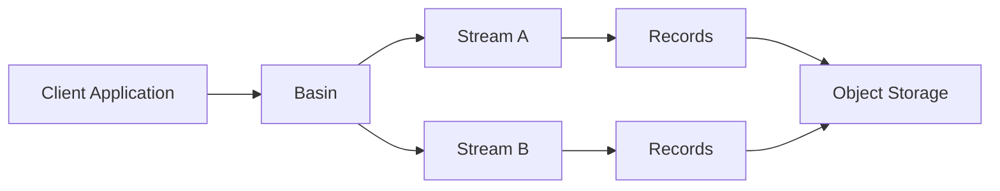

S2 is a serverless datastore for real-time, streaming data. It provides durable, ordered streams backed by object storage with a simple yet powerful API.

## What is S2?

S2 is designed to handle real-time data streams with guaranteed durability and ordering. Unlike traditional message queues or streaming platforms, S2 uses object storage (like AWS S3) as its storage backend, providing:

- **Serverless scalability**: No servers to manage, scales automatically
- **Durable-first design**: Data is always durable on object storage before being acknowledged
- **Simple API**: HTTP-based REST API and streaming protocols
- **Cost-effective**: Leverages inexpensive object storage for long-term retention

## Core concepts

S2's architecture is built around three fundamental concepts:

<CardGroup cols={3}>
  <Card title="Basins" icon="folder" href="/concepts/basins">
    Namespaces that organize and configure streams
  </Card>
  <Card title="Streams" icon="stream" href="/concepts/streams">
    Ordered sequences of records with unique identifiers
  </Card>
  <Card title="Records" icon="file" href="/concepts/records">
    Individual data units with headers and body
  </Card>
</CardGroup>

## How it works

The S2 architecture follows a clear data flow:

### Write path

1. **Client appends** records to a stream within a basin
2. **Sequencing**: Each record receives a unique sequence number and timestamp
3. **Durability**: Records are written to object storage (using SlateDB in s2-lite)
4. **Acknowledgment**: Only after durability is confirmed, the client receives an ack
5. **Broadcasting**: Acknowledged records are broadcast to active followers

### Read path

1. **Client requests** records from a stream starting at a position
2. **Historical data** is read from object storage if needed
3. **Real-time data** can be streamed via SSE or S2S protocols
4. **Followers** receive broadcasts of new records as they're appended

## Key guarantees

<Note>
S2 provides strong guarantees that make it suitable for critical data pipelines:
</Note>

- **Durability**: All acknowledged writes are durable on object storage
- **Ordering**: Records maintain strict ordering within a stream via sequence numbers
- **Exactly-once semantics**: Using fencing tokens and conditional writes
- **Monotonic timestamps**: Timestamps are guaranteed to be monotonically increasing

## Storage architecture

S2-lite (the open-source implementation) uses **SlateDB** as its storage engine:

- **Object storage backend**: All data lives in S3-compatible object storage
- **No local dependencies**: Single binary with no external databases required
- **In-memory mode**: Can run entirely in memory for testing
- **Configurable durability**: Flush intervals and write options can be tuned

<Tip>
In-memory s2-lite is an excellent S2 emulator for integration tests without any external dependencies.
</Tip>

## Use cases

S2 is well-suited for:

- **Event sourcing**: Durable append-only logs for event-driven architectures
- **Change data capture**: Streaming database changes to downstream systems
- **Analytics pipelines**: Collecting and processing time-series data
- **IoT data ingestion**: High-throughput ingestion from distributed sensors
- **Audit logs**: Immutable, ordered logs for compliance and debugging

## API overview

S2 provides multiple ways to interact with the service:

### REST API

- `/basins` - Manage basins (create, list, delete)
- `/streams` - Manage streams (create, list, delete, check tail)
- `/streams/{stream}/records` - Append and read records

### Streaming protocols

- **SSE (Server-Sent Events)**: Browser-compatible streaming reads
- **S2S (S2 Streaming)**: High-performance bidirectional streaming with compression

### Data formats

- **JSON**: Human-readable with base64 encoding for binary data
- **Protobuf**: Efficient binary encoding for production use

## Next steps

<CardGroup cols={2}>
  <Card title="Basins" icon="folder" href="/concepts/basins">
    Learn about organizing streams with basins
  </Card>
  <Card title="Streams" icon="stream" href="/concepts/streams">
    Understand how streams provide ordered sequences
  </Card>
  <Card title="Records" icon="file" href="/concepts/records">
    Explore the structure of individual records
  </Card>
  <Card title="Durability" icon="shield" href="/concepts/durability">
    Deep dive into durability guarantees
  </Card>
</CardGroup>