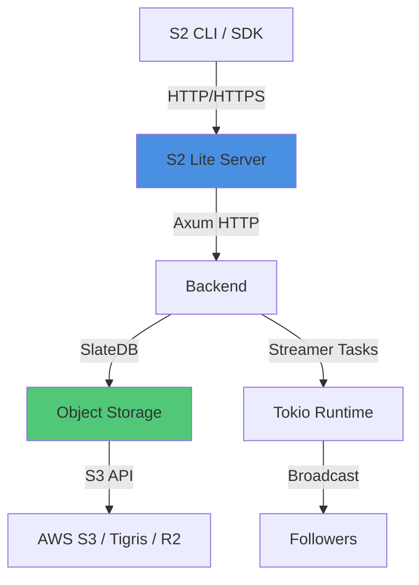

## What is S2 Lite?

S2 Lite is a self-hostable server implementation of the S2 API. It provides a single-node binary with no external dependencies beyond object storage, making it easy to deploy and manage.

### Key Features

- **Fully Compatible**: Implements the complete S2 API specification
- **Object Storage Native**: Uses [SlateDB](https://slatedb.io) as its storage engine, relying entirely on object storage for durability
- **Single Binary**: No additional services or dependencies required
- **Flexible Storage**: Works with AWS S3, Tigris, Cloudflare R2, and any S3-compatible object store
- **In-Memory Mode**: Can run entirely in-memory for testing and development
- **Production Ready**: Data is always durable on object storage before being acknowledged

## When to Use S2 Lite

<CardGroup cols={2}>
  <Card title="Development & Testing" icon="flask">
    Run in-memory mode for integration tests and local development without any external dependencies.
  </Card>
  
  <Card title="Self-Hosted Production" icon="server">
    Deploy on your own infrastructure with full control over data location and compliance.
  </Card>
  
  <Card title="Edge Deployments" icon="globe">
    Run closer to your data sources using regional object storage like Cloudflare R2 or Tigris.
  </Card>
  
  <Card title="Cost Optimization" icon="dollar-sign">
    Leverage lower-cost object storage tiers for specific workloads.
  </Card>
</CardGroup>

## Deployment Modes

### In-Memory (Development)

```bash
s2 lite --port 8080
```

Perfect for:
- Local development
- Integration testing
- CI/CD pipelines
- Quick experimentation

<Warning>
In-memory mode loses all data when the process stops. Use only for development and testing.
</Warning>

### Local Filesystem (Testing)

```bash
s2 lite --local-root ./s2-data --port 8080
```

Perfect for:
- Persistent local testing
- Single-node development environments
- Data that needs to survive restarts

<Note>
Local filesystem mode is not recommended for production as it lacks the durability guarantees of object storage.
</Note>

### Object Storage (Production)

```bash
s2 lite --bucket my-s2-bucket --path s2lite --port 8080
```

Perfect for:
- Production deployments
- Multi-region setups
- Durable, scalable storage
- Kubernetes environments

## Architecture



### Internal Components

- **HTTP Server**: Built with [axum](https://github.com/tokio-rs/axum) for high-performance async I/O
- **Streamer Tasks**: Each stream has a dedicated Tokio task that owns the tail position and broadcasts to followers
- **SlateDB Engine**: Provides durable key-value storage backed entirely by object storage
- **Pipelining**: Appends are pipelined to improve performance against high-latency object storage

<Note>
Pipelining is currently disabled by default. Enable with `S2LITE_PIPELINE=true` to preview future performance improvements.
</Note>

## SDK Compatibility

S2 Lite is compatible with all official S2 SDKs:

| SDK | Status | Minimum Version |
|-----|--------|----------------|
| [CLI](/quickstart) | ✅ Supported | v0.26+ |
| [TypeScript SDK](https://github.com/s2-streamstore/s2-sdk-typescript) | ✅ Supported | v0.22+ |
| [Go SDK](https://github.com/s2-streamstore/s2-sdk-go) | ✅ Supported | v0.11+ |
| [Rust SDK](https://github.com/s2-streamstore/s2-sdk-rust) | ✅ Supported | v0.22+ |
| [Python SDK](https://github.com/s2-streamstore/s2-sdk-python) | 🚧 Migration needed | - |
| [Java SDK](https://github.com/s2-streamstore/s2-sdk-java) | 🚧 Migration needed | - |

## API Coverage

S2 Lite implements the complete [S2 API specification](/api/overview):

| Endpoint | Support |
|----------|----------|
| `/basins` | ✅ Supported |
| `/streams` | ✅ Supported |
| `/streams/{stream}/records` | ✅ Supported |
| `/access-tokens` | ❌ Not supported ([#28](https://github.com/s2-streamstore/s2/issues/28)) |
| `/metrics` | ❌ Not supported |

<Warning>
Unlike the cloud service, requests to `/streams/*` **must** include the `S2-Basin` header. The SDKs handle this automatically.
</Warning>

## Monitoring & Observability

S2 Lite includes built-in monitoring endpoints:

- **`/health`**: Returns 200 OK for readiness and liveness checks
- **`/metrics`**: Prometheus-compatible metrics in text format

## Next Steps

<CardGroup cols={2}>
  <Card title="S3 Setup" icon="database" href="/guides/self-hosting/s3-setup">
    Configure S3, Tigris, or R2 for production deployments
  </Card>
  
  <Card title="Production Deployment" icon="rocket" href="/guides/self-hosting/production-deployment">
    Deploy S2 Lite with Kubernetes and Helm
  </Card>
  
  <Card title="Backup & Restore" icon="shield" href="/guides/self-hosting/backup-restore">
    Learn backup strategies and disaster recovery
  </Card>
  
  <Card title="API Reference" icon="book" href="/api/overview">
    Explore the complete S2 API specification
  </Card>
</CardGroup>